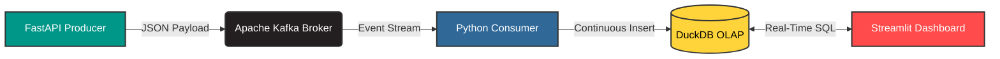

# 📈 High-Throughput Real-Time Market Analytics Pipeline


## 📌 Objective
An end-to-end, fully localized event-streaming architecture designed to simulate the ingestion, processing, and visualization of High-Frequency Trading (HFT) market data in real-time. This project demonstrates enterprise-grade decoupling, in-memory OLAP processing, and systemic load testing.

## 🏗️ System Architecture



The pipeline is strictly decoupled to ensure high availability and zero data loss during high-velocity bursts:
* **Data Generation (`producer_api.py`):** Asynchronous endpoint producing synthetic equity ticks.
* **Message Broker (`docker-compose.yml`):** Containerized Apache Kafka buffering the stream.
* **Analytical Engine (`consumer_storage.py`):** Consumer reading the stream and writing to DuckDB for real-time aggregation (20-Tick SMA, Volatility).
* **Serving Layer (`app_dashboard.py`):** Streamlit querying DuckDB to render a sub-second latency live dashboard.

## 📊 Performance & Stress Test Metrics
The architecture was mathematically load-tested (`stress_test.py`) using a custom asynchronous `httpx` + `asyncio` script to identify systemic bottlenecks and backpressure handling.

* **Sustained Throughput:** Verified continuous ingestion of **500 Requests Per Second (RPS)** (~1.8 Million events/hour) with zero Kafka consumer lag.
* **In-Memory Querying:** DuckDB successfully maintained sub-millisecond read/write locks, allowing the UI to render rolling averages on the fly without database locking.
* **Systemic Limit Identified:** Max concurrency limit reached at **1,000 RPS**, resulting in HTTP connection pool exhaustion at the FastAPI worker layer (`httpcore.PoolTimeout`), proving the backend storage outpaces localized web-server I/O.

## 🚀 How to Run Locally

### 1. Start the Infrastructure
```bash
docker-compose up -d
```

### 2. Initialize the Pipeline (Run in separate terminals)
```bash
# Start the FastAPI Producer
uvicorn producer_api:app --reload

# Start the Kafka-to-DuckDB Consumer
python consumer_storage.py

# Launch the Live Dashboard
streamlit run app_dashboard.py
```

### 3. Execute the Stress Test
```bash
python stress_test.py
```

## 📸 Dashboard Telemetry

```
